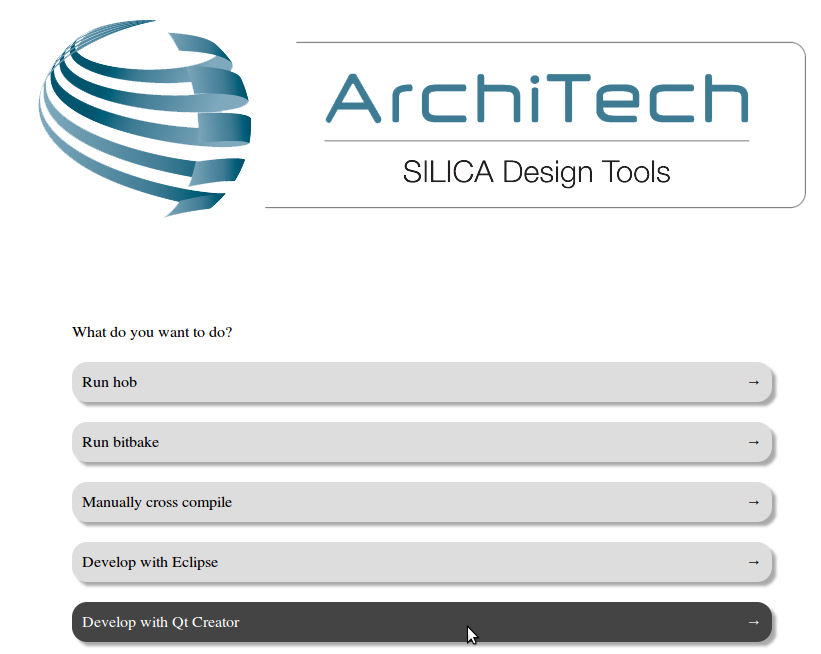
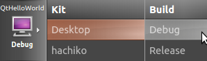
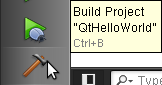

Qt Creator IDE
==============

| **Qt** is a cross-platform application framework that is used to build applications. One of the best features of Qt is its capability of generating Graphical User Interfaces (GUIs).
| **Qt Creator** is a cross-platform C++ IDE which includes a visual debugger, an integrated GUI layout and form designer. It makes possible to compile and debug applications on both **x86** (host) and **ARM** (target) machines.
| This SDK relies on **version 4.8.5** of Qt and **version 2.8.1** of Qt Creator.
|

.. note::

 Before reading this Chapter you should know how to use HOB and bitbake.

Build an image with qt support
------------------------------

1. Using HOB or bitbake, build an image with Qt libraries included (refer to :ref:`howToUseHOB` and/or :ref:`bitbake_label` Chapters).

2. Once the image has been built, untar the corresponding root file system inside directory "/home/@user@/architech_sdk/architech/@board-alias@/sysroot" and setup with the same file system the root file system of the board.

Hello World!
------------

The purpose of this example project is to generate a form with an "Hello World" label in it, at the beginning on the x86 virtual machine and than on @board@ board.

To create the project follow these steps:

1. Use the **Welcome Screen** to run Qt Creator by selecting *Architech→@board@→Develop with Qt Creator*

2. Go to *File -> Open File or Project* to open **QtHelloWorld.pro** file located in */home/@user@/architech_sdk/architech/@board-alias@/workspace/qt/QtHelloWorld/* directory.

3. Click on "QtHelloWorld" icon to open project menu.

.. image:: _static/qt-1.png

4. Select the build configuration: **Desktop - Debug**.

5. To build the project, click on the bottom-left icon.

6. Once you built the project, click on the green triangle to run it.

.. image:: _static/qt-4.png

7. Congratulations! You just built your first Qt application for x86.

.. image:: _static/qt-5.png

In the next section we will debug our Hello World! application directly on @board@.

Debug Hello World project
-------------------------

8. Select build configuration: **@board-alias@ - Debug** and build the project.

.. image:: _static/qt-10.png

9. Copy the generated executable to the target board (e.g /home/root/).

::

  scp /home/@user@/architech_sdk/architech/@board-alias@/workspace/qt/build-QtHelloWorld-Hachiko-Debug/QtHelloWorld root@@target-ip@:/home/root

10. Use minicom to launch gdbserver application on the target board:

::

  gdbserver :10000 QtHelloWorld -qws

11. | In Qt Creator, open the source file main.cpp and set a breakpoint at line 6. 
    | To do this go with the mouse at line 6 and click with the right button to open the menu, select **Set brackpoint at line 6**

.. image:: _static/qt-6.png

12. Go to *Debug→Start Debugging→Attach To Remote Debug Server*, a form named "Start Debugger" will appear, insert the following data:

.. image:: _static/qt-7.png

- Kit: **@board-alias@**

- Local executable: **/home/@user@/architech_sdk/architech/@board-alias@/workspace/qt/build-QtHelloWorld-@board-alias@-Debug/QtHelloWorld**

Press **OK** button to start the debug.

.. image:: _static/qt-8.png

13. The hotkeys to debug the application are:

- **F10**: Step over

- **F11**: Step into

- **Shift + F11**: Step out

- **F5**: Continue, or press this icon:

.. image:: _static/qt-9.png

14. To successfully exit from the debug it is better to close the graphical application from the target board with the mouse by clicking on the 'X' symbol. 

