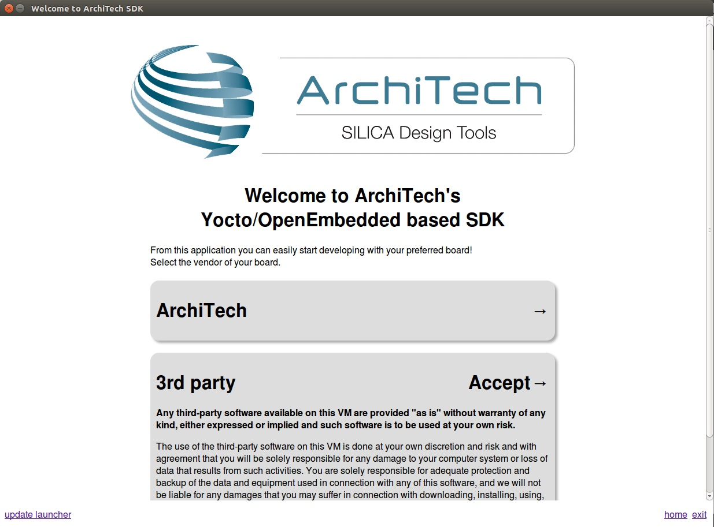
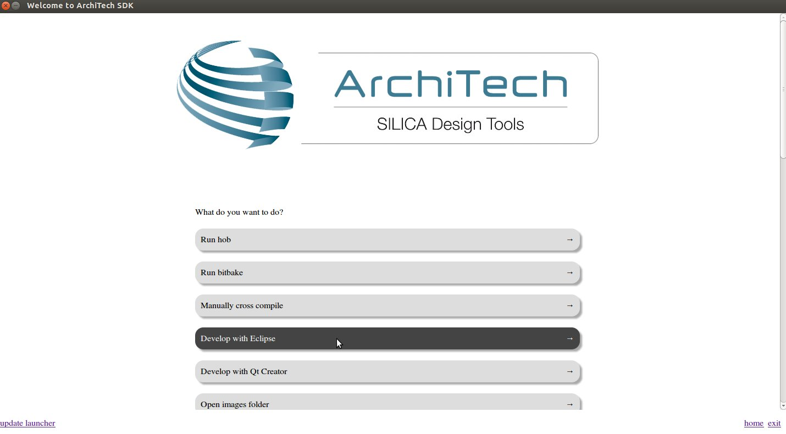
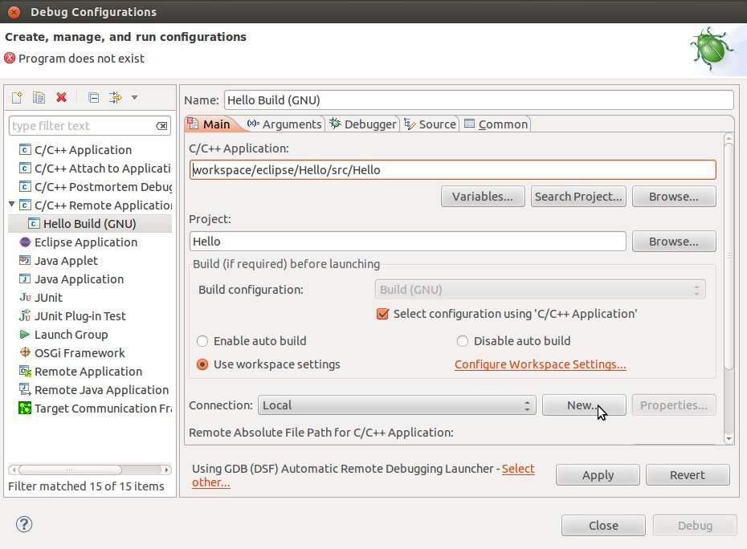
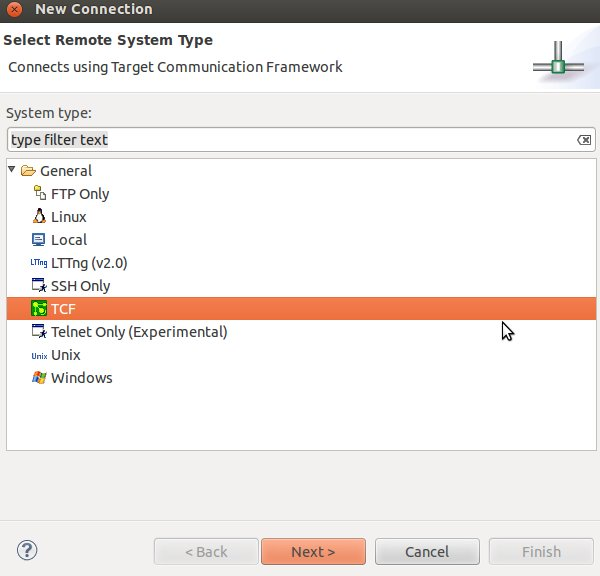
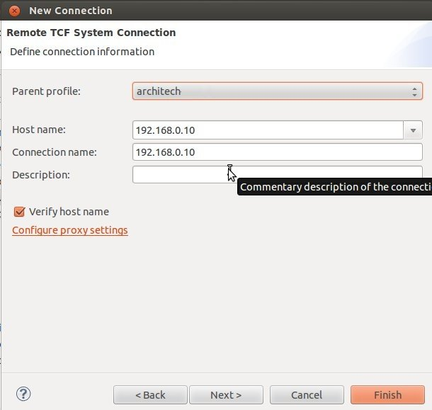
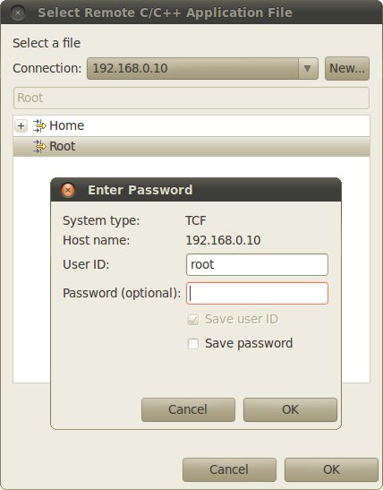
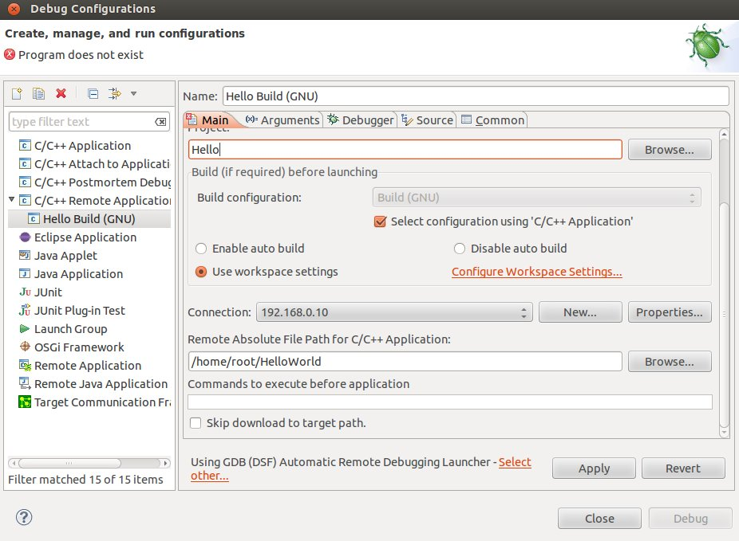
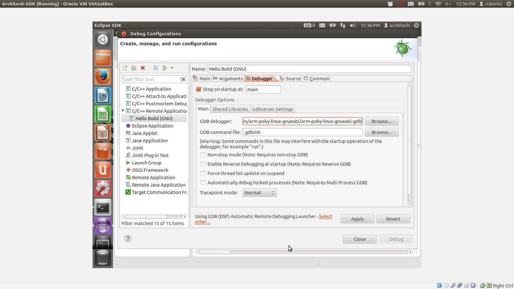

.. _quick:

*****************
Quick start guide
*****************

This document will guide you from importing the virtual machine to debugging an *Hello World!* example on a customized Linux distribution you will generate with **OpenEmbedded**/**Yocto** toolchain.

Install
=======
.. include:: vdi.rst

Such a modification will be effective after a logout and subsquent login or after a reboot of the virtual machine, so just shutdown the virtual machine so you can catch up with the next section.

Patch
=====

Be sure you have the proper version of sources and binaries by running a patch script.

1. If not already started, start the VM by selecting the virtual machine from the list and by clicking on *Start* button.

.. image:: _static/vbStart.png
    :align: center

2. Verify that you have a working Internet connection by surfing the web with Firefox or by trying to ping a public server (e.g. *www.google.com*).

3. Download and execute the patch script

.. host::

 | cd ~/Documents
 | wget http://downloads.architechboards.com/sdk/virtual_machine/patch.sh
 | chmod +x patch.sh
 | ./patch.sh

4. When the script successfully completes, it displays this message

::

 Patch installed correctly

If instead the script hangs or generates errors, please be sure you have a working Internet connection from inside the virtual machine.

Build
=====

.. important::

 A working internet connection, several GB of free disk space and several hours are required by the build process

1. Double click on *Architech SDK* icon you have on the virtual machine desktop.

.. image:: _static/splash0.jpg
    :align: center

2. The first screen gives you two choices: *ArchiTech* and *3rd Party*. Choose *ArchiTech*.

3. Select @board@ as board you want develop on. 

.. image:: _static/splashscreen_board_selection.jpg
    :align: center

4. A new screen opens up from where you can perform a set of actions. Click on *Run bitbake* to obtain a terminal ready to start to build an image.

.. image:: _static/splash3.jpg
    :align: center

5. Open *local.conf* file:

.. host::

 | gedit conf/local.conf

6. Go to the end of the file and add the following lines:

.. host::

 | EXTRA_IMAGE_FEATURES_append = " tools-debug debug-tweaks"
 | IMAGE_INSTALL_append = " tcf-agent"

This will trigger the installation of a features set onto the final root file system, like *tcf-agent* and *gdbserver*.

7. Save the file and close gedit.

8. Build *@quickstart-image@* image by means of the following command:

.. host::

 | bitbake @quickstart-image@

At the end of the build process, the image will be saved inside directory:

.. host::

 | /home/@user@/architech_sdk/architech/@board-alias@/yocto/build/tmp/deploy/images/@machine-name@

9. Setup *sysroot* directory on your host machine:

.. host::

 | sudo tar -xjf /home/@user@/architech_sdk/architech/@board-alias@/yocto/build/tmp/deploy/images/@machine-name@/@quickstart-image@-@machine-name@.tar.bz2 -C /home/@user@/architech_sdk/architech/@board-alias@/sysroot/

.. note::

 **sudo** password is: "**@user-password@**"

Deploy
======

.. include:: deploy_rootfs.rst

Boot
====

.. include:: quick_boot.rst

Code
====

The time to create a simple *HelloWorld!* application using **Eclipse** has come. 

1. Return to the **Splashscreen**, which we left on @board@ board screen, and click on *Develop with Eclipse*.

2. Go to *File→ New→ Project*, select *C/C++→ C Project* and press *next* button.

.. image:: _static/eclipse-newprj1.jpg
    :align: center

3. Insert *HelloWorld* as project name, select *Hello World ANSI C Autotools Project* and press *next* button.

.. image:: _static/eclipse-new-project.jpg
    :align: center

4. Insert *Author* field and click on *Finish* button. Select *Yes* on the *Open Associated Perspective?* question.

5. Build the project by selecting *Project→ Build All*.

Debug
=====

Use an ethernet cable to connect the board (connector @quick-lan-connector@) to your PC.
Configure your workstation ip address as @vm-ip@.
Make sure the board can be seen by your host machine:

.. board::

 | ifconfig @target-default-eth-if@ @target-ip@

.. host::

 | ping @target-ip@

If the output is similar to this one:

.. host::

 | 64 bytes from @vm-ip@: icmp_req=1 ttl=64 time=0.946 ms
 | 64 bytes from @vm-ip@: icmp_req=2 ttl=64 time=0.763 ms
 | 64 bytes from @vm-ip@: icmp_req=3 ttl=64 time=0.671 ms
 | 64 bytes from @vm-ip@: icmp_req=4 ttl=64 time=0.793 ms

then the ethernet connection is ok. Enable the remote debug with Yocto by typing this command on @board@ console:

.. board::

 | /etc/init.d/tcf-agent restart

On the Host machine, follow these steps to let **Eclipse** deploy and debug your application:

* Select Run→ Debug Configurations...
* In the left area, expand *C/C++Remote Application*.
* Locate your project and select it to bring up a new tabbed view in the *Debug Configurations* Dialog.

* Insert in *C/C++ Application* the filepath (on your host machine) of the compiled binary.
* Click on *New* button near the drop-down menu in the *Connection* field.
* Select *TCF* icon.

* Insert in *Host Name* and *Connection Name* fields the IP address of the target board. (e.g. @target-ip@)

* Then press *Finish*.

* Use the drop-down menu now in the *Connection* field and pick up the IP Address you entered earlier.

* Enter the absolute path on the target into which you want to deploy the cross-compiled application. Use the *Browse* button near *Remote Absolute File Path for C/C++Application:* field. No password is needed.

* Enter also in the path the name of the application you want to debug. (e.g. Hello)

* Select *Debugger* tab

* In GDB Debugger field, insert the filepath of gdb for your toolchain

.. host::

 | /home/@user@/architech_sdk/architech/@board-alias@/toolchain/sysroots/i686-pokysdk-linux/usr/bin/arm-poky-linux-@eabi@/arm-poky-linux-@eabi@-gdb

* In *Debugger* window there is a tab named *Shared Library*, click on it.
* Add the libraries paths *lib* and *usr/lib* of the rootfs (which must be the same used in the target board)

.. host::

 | /home/@user@/architech_sdk/architech/@board-alias@/sysroot/lib
 | /home/@user@/architech_sdk/architech/@board-alias@/sysroot/usr/lib

* Click *Debug* to login.
* Accept the debug perspective. 

.. important::

 If debug does not work, check on the board if *tcf-agent* is running and *gdbserver* has been installed.

