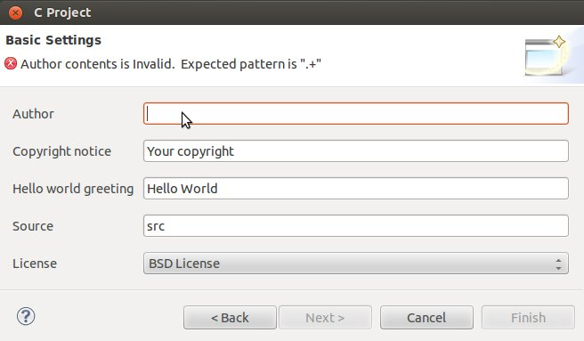
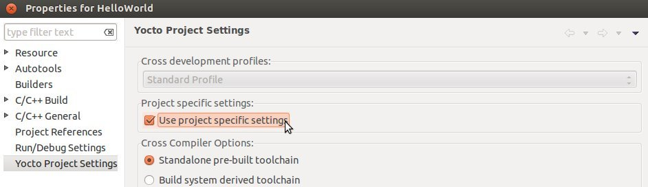

.. _quick:

*****************
Quick start guide
*****************

This document will guide you from importing the virtual machine to debugging an *Hello World!* example on a customized Linux distribution you will generate with **OpenEmbedded**/**Yocto** toolchain.

Install
=======
.. include:: vdi.rst

Build
=====
.. include:: quick_build.rst

.. _quick_deploy_rootfs_label:

Deploy
======

.. include:: deploy_rootfs.rst

Boot
====

.. include:: quick_boot.rst

Code
====

The time to create a simple *HelloWorld!* application using **Eclipse** has come. 

1. Return to the **Splashscreen**, which we left on @board@ board screen, and click on *Develop with Eclipse*.

.. image:: _static/splash4.jpg
    :align: center

2. Go to *File→ New→ Project...*, in the node "C/C++" select *C Project* and press *next* button.

.. image:: _static/eclipse-newprj1.jpg
    :align: center

3. Insert *HelloWorld* as project name, open the node *Yocto Project ADT Autotools Project* and select *Hello World ANSI C Autotools Project* and press *next* button.

.. image:: _static/eclipse-new-project.jpg
    :align: center

4. Insert *Author* field and click on *Finish* button. Select *Yes* on the *Open Associated Perspective?* question.

5. Open the windows properties clicking on *Project→ Properties* and select *Yocto Project Settings*. Check *Use project specific settings* in order to use the pengwyn cross-toolchain.

5. Click on *OK* button and build the project by selecting *Project→ Build All*.

Debug
=====

Use an ethernet cable to connect the board (connector @quick-lan-connector@) to your PC.
Configure your workstation ip address as @vm-ip@.
Make sure the board can be seen by your host machine:

.. board::

 | ifconfig @target-default-eth-if@ @target-ip@

.. host::

 | ping @target-ip@

If the output is similar to this one:

.. host::

 | 64 bytes from @vm-ip@: icmp_req=1 ttl=64 time=0.946 ms
 | 64 bytes from @vm-ip@: icmp_req=2 ttl=64 time=0.763 ms
 | 64 bytes from @vm-ip@: icmp_req=3 ttl=64 time=0.671 ms
 | 64 bytes from @vm-ip@: icmp_req=4 ttl=64 time=0.793 ms

then the ethernet connection is ok. Enable the remote debug with Yocto by typing this command on @board@ console:

.. board::

 | /etc/init.d/tcf-agent restart

On the Host machine, follow these steps to let **Eclipse** deploy and debug your application:

* Select *Run→ Debug Configurations...*
* In the left area, expand *C/C++Remote Application*.
* Locate your project and select it to bring up a new tabbed view in the *Debug Configurations* Dialog.

.. image:: _static/debugform.jpg
    :align: center

* Insert in *C/C++ Application* the filepath (on your host machine) of the compiled binary.
* Click on *New* button near the drop-down menu in the *Connection* field.
* Select *TCF* icon.

.. image:: _static/tcf1.jpg
    :align: center

* Insert in *Host Name* and *Connection Name* fields the IP address of the target board. (e.g. @target-ip@)

.. image:: _static/tcf2.jpg
    :align: center

* Then press *Finish*.

* Use the drop-down menu now in the *Connection* field and pick up the IP Address you entered earlier.

* Enter the absolute path on the target into which you want to deploy the cross-compiled application. Use the *Browse* button near *Remote Absolute File Path for C/C++Application:* field. No password is needed.

.. image:: _static/remotepath.jpg
    :align: center

* Enter also in the path the name of the application you want to debug. (e.g. HelloWorld)

.. image:: _static/debug2.jpg
    :align: center

* Select *Debugger* tab

.. image:: _static/gdb.jpg
    :align: center

* In GDB Debugger field, insert the filepath of gdb for your toolchain

.. host::

 | /home/@user@/architech_sdk/architech/@board-alias@/toolchain/sysroots/i686-pokysdk-linux/usr/bin/arm-poky-linux-@eabi@/arm-poky-linux-@eabi@-gdb

* In *Debugger* window there is a tab named *Shared Library*, click on it.
* Add the libraries paths *lib* and *usr/lib* of the rootfs (which must be the same used in the target board)

.. host::

 | /home/@user@/architech_sdk/architech/@board-alias@/sysroot/lib
 | /home/@user@/architech_sdk/architech/@board-alias@/sysroot/usr/lib

* Click *Debug* to login.
* Accept the debug perspective. 

.. important::

 If debug does not work, check on the board if *tcf-agent* is running and *gdbserver* has been installed.
 You can ignore the message "Cannot access memory at address 0x0".
